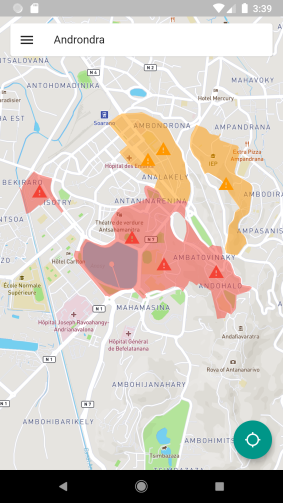

# Markovid

> Application permettant de voir les zones risquées dans le cadre du COVID-19

## Technologies 

1. [Flutter](https://flutter.dev/) - State management (Provider)
2. [Mapbox](https://www.mapbox.com/)
3. Socket.io

## Backend

Voir [ici](https://github.com/rajaomariajaona/markovid-back)

## Releases

Voir [ici](https://github.com/rajaomariajaona/markovid-mobile/releases)

## Screenshot

